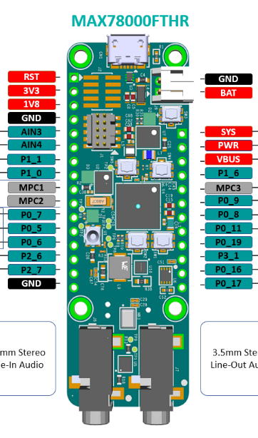

# Smarter Play Occupation Detection

Code is an adapted version of the Deep Vision Consulting People Detection example, which uses the standard Maxim Integrated Face ID model trained using images taken from the COCO object detection dataset.

## Board connections

The board can get (5V) power from its USB port or from the VBUS pin on the schematic.

The red built-in LED and the detection output signal on pin P1_6 (fourth on the 12-pin row starting from the white battery connector) stays HIGH (at around 1.5V) while the board is detecting people (by taking pictures with its builtin camera and passing them through a CNN).
